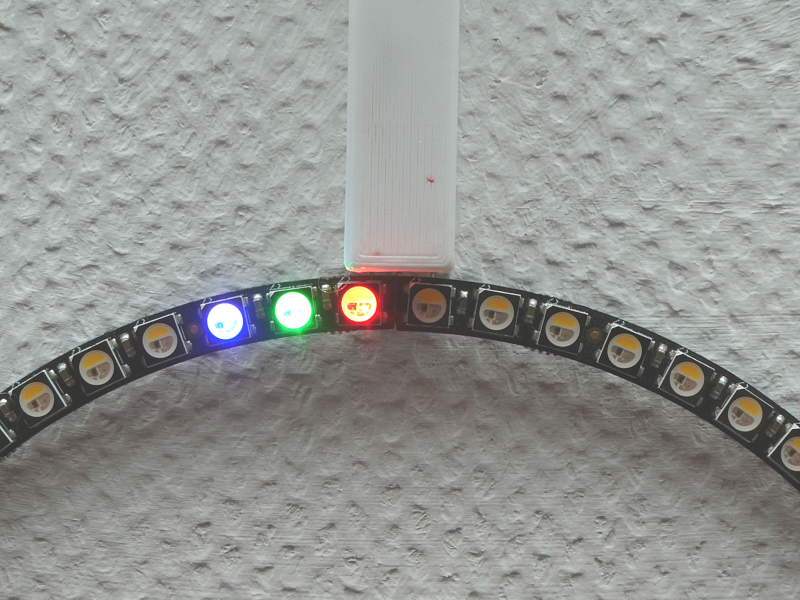

# Neo clock 2: NeoPixel clock with ESP8266 and minimalistic design

## All infos on: <http://www.weigu.lu/microcontroller/neo_clock_2/index.html>

## Some infos

A NeoPixel ring with 60 RGBW LED's connected to an ESP8266 gives us a clock using NTP server to get the accurate time. No external RTC needed. The time lib that is integrated in the ESP8266 core gets the time from an NTP server and runs an internal RTC. Our hardware is reduced to the strict minimum. Only a 74HCT125 IC is needed as logic-level shifter.
A light sensor can be used to dim the LED's at night.

The ESP can be programmed with OTA an debugging is possible with UDP.

Infos on NTP with ESP8266: <http://weigu.lu/microcontroller/tips_tricks/esp_NTP_tips_tricks/index.html>
Infos on logic-level-shifter6: <http://weigu.lu/microcontroller/tips_tricks/level_shifter_tts/index.html>

